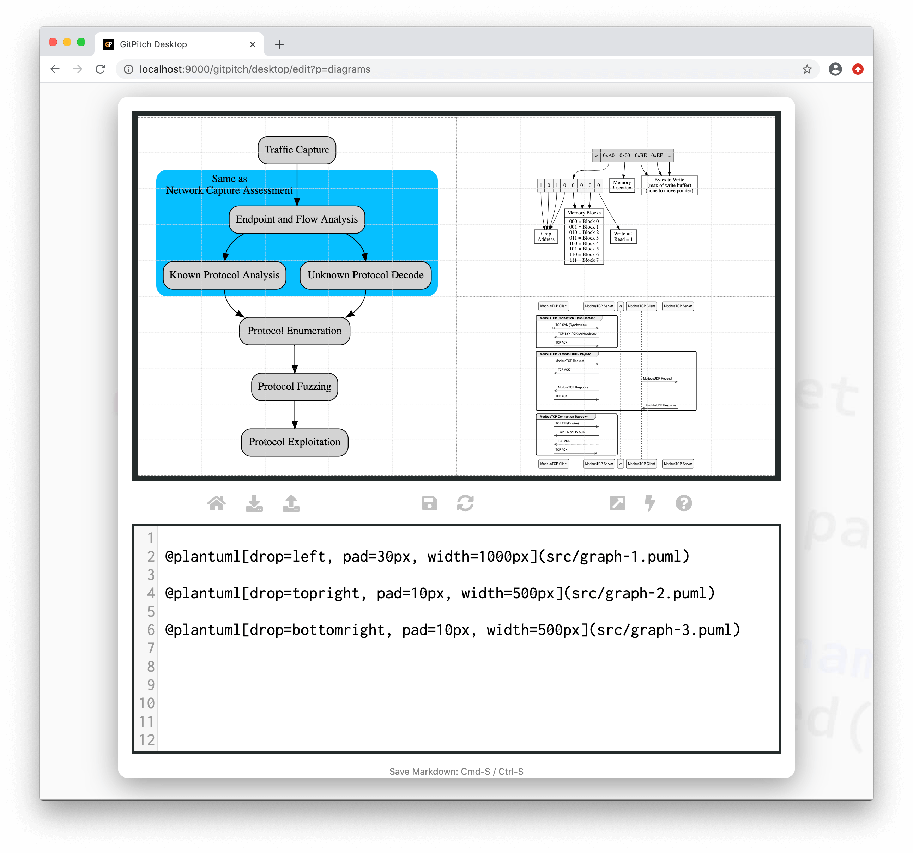

# Graphviz/DOT Diagrams

?> GitPitch widgets greatly enhance traditional markdown rendering capabilities for slide decks.

The [PlantUML Widget](/diagrams/plantuml.md) makes use of [Graphviz/DOT Visualization Software](http://www.graphviz.org) for rendering under the hood. This guide describes how you can leverage Graphviz/Dot
support directly to generate sophisticated graphs on any slide.

### Widget Paths

All paths to graphviz description files specified within [PITCHME.md](/conventions/pitchme-md.md) markdown must be relative to the *root directory* of your local working directory or Git repository.

### Widget Syntax

The following markdown snippet demonstrates graphviz widget syntax:

```markdown
@plantuml[properties...](path/to/file.puml)
```

?> The `properties...` list expects a comma-separated list of property `key=value` pairs.

Each diagram is defined using a simple text-based syntax within a dedicated description file. The exact syntax is defined by the [PlantUML Dot Project](https://plantuml.com/dot). The following conventions are enforced:

1. *PlantUML Dot* diagram descriptions **must** be defined in a file within your local repository.
1. These *PlantUML Dot* diagram description files must have a **.puml** extension.
1. The contents of your diagram description files must adhere to valid [PlantUML Dot](https://plantuml.com/dot) syntax. 

[PlantUML Properties](../_snippets/diagrams-plantuml-properties.md ':include')

### Sample Slide

The following slide demonstrates a sample sequence diagram rendered using plantuml widget syntax. The markdown snippet used to create this slide takes advantage *grid native properties* to position, size, and transform the diagram on the slide:



### Sample Dot Sytnax

The *dot syntax* used to create the sample diagrams shown above was kindly provided by a member of the GitPitch community (thanks Justin!) and is provided here for reference:


<!-- tabs:start -->

#### ** Left Diagram **

```puml
@startuml
digraph G {
  node [shape=record, fillcolor=lightgrey, style="filled,rounded"]
  capture [label="Traffic Capture"]
  capture -> analyze

  subgraph cluster0 {
    label = "Same as\nNetwork Capture Assessment"
    labeljust = left
    style = "filled,rounded"
    color = deepskyblue
    analyze [label="Endpoint and Flow Analysis"]
    analyze:0 -> known:n
    analyze:1 -> unknown:n
    known [label="Known Protocol Analysis"]
    unknown [label="Unknown Protocol Decode"]
  }

  known:s -> enum:0
  unknown:s -> enum:1
  enum [label="Protocol Enumeration"]
  enum -> fuzz
  fuzz [label="Protocol Fuzzing"]
  fuzz -> exploit
  exploit [label="Protocol Exploitation"]
}
@enduml
```

#### ** Top-Right Diagram **

```puml
@startuml
digraph structs {
  node [shape=record];
  write [label="\> | <0>0xA0 | <1>0x00 | <2>0xBE | <3>0xEF | <4>...", fillcolor=lightgrey, style=filled];

  write:0 -> command:4;
    command [label="<0>1|<1>0|<2>1|<3>0|<4>0|<5>0|<6>0|<7>0", fillcolor=whitesmoke, style=filled];
    command:0 -> chip:0;
    command:1 -> chip:1;
    command:2 -> chip:2;
    command:3 -> chip:3;
      chip [label="Chip\nAddress"];
    command:4 -> memblock:0;
    command:5 -> memblock:1;
    command:6 -> memblock:2;
      memblock [label="{Memory Blocks | 000 = Block 0\n001 = Block 1\n010 = Block 2\n011 = Block 3\n100 = Block 4\n101 = Block 5\n110 = Block 6\n111 = Block 7}"];
    command:7 -> rw;
      rw [label="Write = 0\nRead = 1"];

  write:1 -> address;
    address [label="Memory\nLocation"];

  write:2 -> data:0;
  write:3 -> data:1;
  write:4 -> data:2;
    data [label="Bytes to Write\n(max of write buffer)\n(none to move pointer)"];

}
@enduml
```

#### ** Bottom-Left Diagram **

```puml
@startuml
skinparam monochrome true
skinparam shadowing false
skinparam sequenceArrowThickness 2
skinparam roundcorner 10
skinparam sequenceReferenceAlign center

participant "ModbusTCP Client" as TcpClient
participant "ModbusTCP Server" as TcpServer
participant "vs"
participant "ModbusTCP Client" as UdpClient
participant "ModbusTCP Server" as UdpServer

group ModbusTCP Connection Establishment
  TcpClient o-> TcpServer: TCP SYN (Synchronize)
  TcpServer -> TcpClient: TCP SYN ACK (Acknowledge)
  TcpClient -> TcpServer: TCP ACK
end

group ModbusTCP vs ModbusUDP Payload
  TcpClient -> TcpServer : ModbusTCP Request
  TcpClient <- TcpServer : TCP ACK
  UdpClient -> UdpServer : ModbusUDP Request
  TcpServer -> TcpClient : ModbusTCP Response
  TcpServer <- TcpClient : TCP ACK
  UdpClient <- UdpServer : ModubsUDP Response
end

group ModbusTCP Connection Teardown
  TcpClient -> TcpServer: TCP FIN (Finalize)
  TcpClient <- TcpServer: TCP FIN or FIN ACK
  TcpClient <-- TcpServer: TCP ACK
  TcpClient ->x TcpServer: TCP ACK
End
@enduml
```

<!-- tabs:end -->

