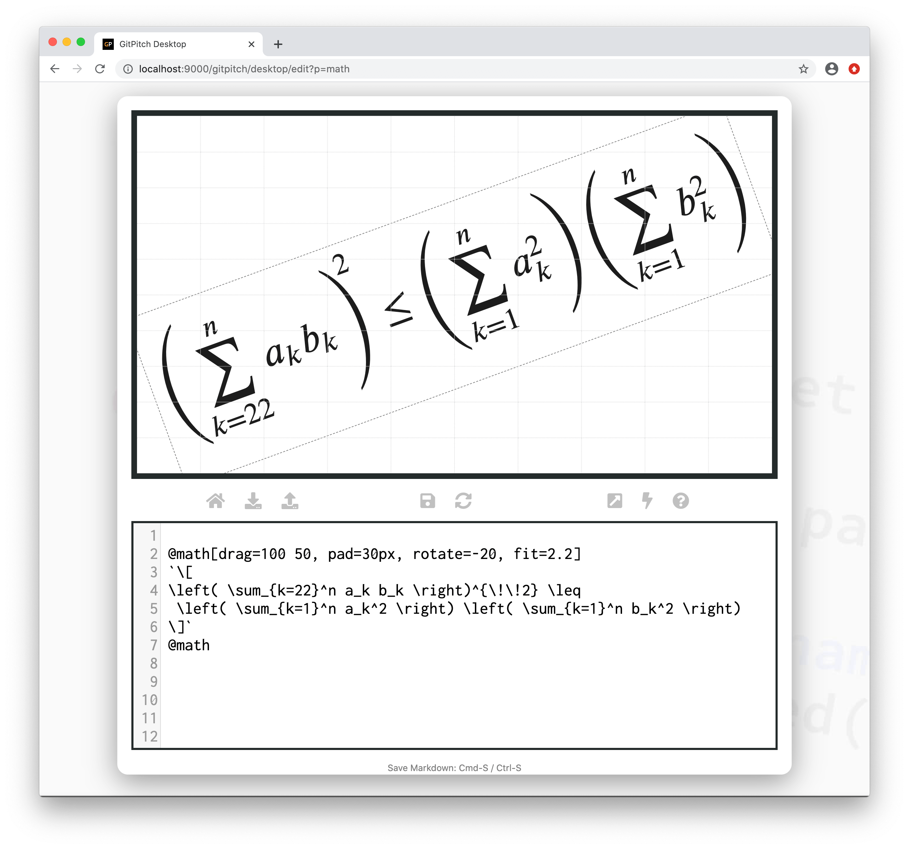

# Grid Fit for Maths

The grid *fit* property is used to scale and size math formulas within [layout blocks](/grid-layouts/drag-and-drop.md).

?> Fit takes a scaling value. Any value greater than 1 magnifies content. Any value less than 1 shrinks content. A value equal to 1 renders the content at it’s original size. Original size is determined by the [theme settings](/theme/template.md) for your slide deck.

### Basic Syntax

The following basic syntax is used to activate a custom *fit* for math content within a layout block:

```
@math[drag=width height, drop=x y, fit=scale]
Your MathJax formulas here.
@math
```
?> For math widget syntax details see the [Math Widget Guide](/maths/mathjax-formulas.md).

Where *scale* can take any value between *0.01* and *99.99*. If the `fit=` property is not specified for a block then the block automatically inherits the default *scale* of 1.0. A fit value greater than *1.0* magnifies math content. While a fit value less than *1.0* shrinks math content.

The best `fit=scale` value for your content depends on:

1. The math content itself
2. The font active for that math content and
3. The dimensions of the target block.

Simply experiment with *scale* values to find the best fit for your math content within the block.

### Fit to Block

The following sample slide screenshot demonstrates `fit=` on maths content. The grid layouts block in this example is sized and rotated while the math formula is scaled to fill the block on the slide:



### Fit to Size

The following sample slide screenshot demonstrates `fit=` on maths content. Here no grid layouts block is in use. The math formula is simply scaled to size using the `fit=` property on the math widget:


