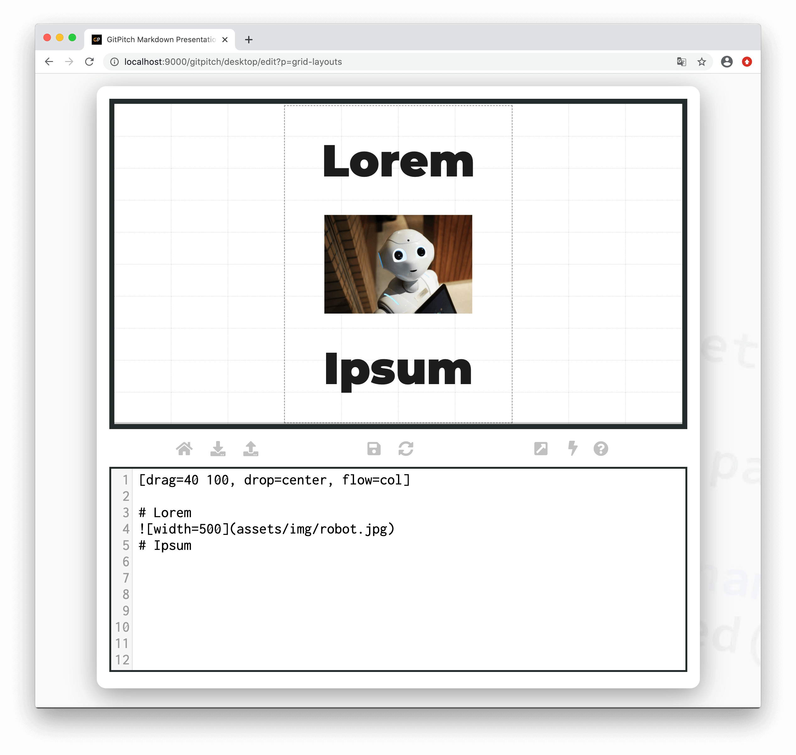
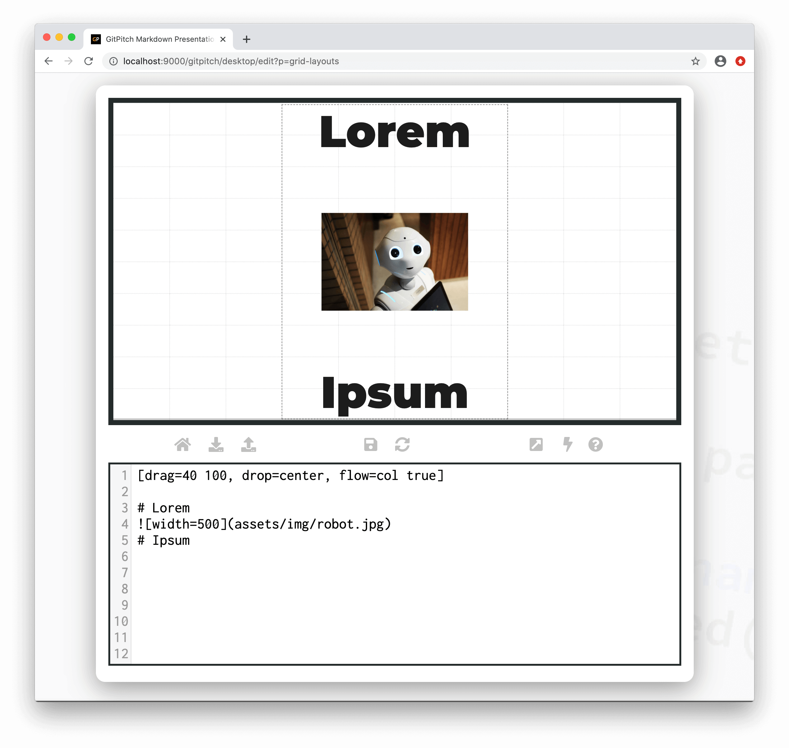
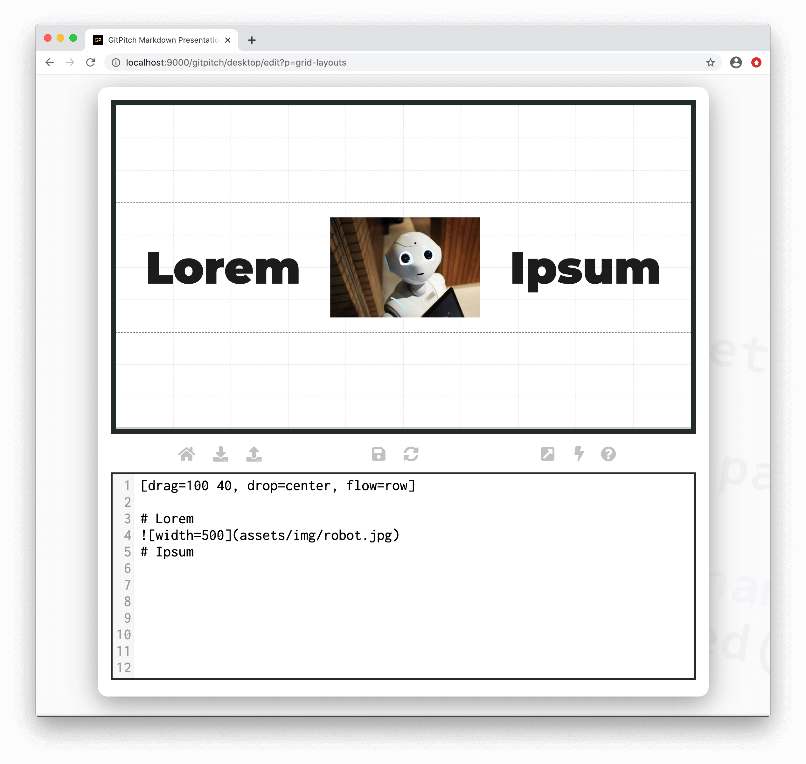

# Grid Layouts Flow

Grid layouts [drag-and-drop](/grid-layouts/drag-and-drop.md) both sizes and positions content on your slides. This is achieved using a simple concept called a block. The grid *flow* property on a block is used to control the layout of content within the block.

?> When discussing grid layouts *content-within-blocks* are referred to as *block items*.

### Basic Syntax

The following basic syntax is used to activate a custom *flow* for any block:

```
[drag=width height, drop=x y, flow=col | row | stack]
```

Using a value of [col](#column-flow), [row](#row-flow), or [stack](#stack-flow) on the `flow=` property defines the layout behavior for the block. If the `flow=` property is not specified for a block then the block automatically inherits the default `col` flow behavior.


### Column Flow

When `flow=col` is activated block items are rendered vertically within the block. An equal amount of space is injected between each block item and at the start and end of the block. The following sample slide screenshot helps to clarify this concept. Note, the sample block height here is 100% of the slide height:



?> Flow is activated for a block with zero changes to the markdown of individual block items.

### Column Flow with Push

When `flow=col true` is activated block items are rendered vertically within the block. An equal amount of space is injected between each block item, however no space is injected at the start and end of the block. This *pushes* your block items to the extreme ends of the block. The following sample slide screenshot helps to clarify this concept. Note, the sample block height here is 100% of the slide height:



?> Flow is activated for a block with zero changes to the markdown of individual block items.

### Row Flow

When `flow=row` is activated block items are rendered horizontally within the block. An equal amount of space is injected between each block item and at the start and end of the block. The following sample slide screenshot helps to clarify this concept. Note, the sample block width here is 100% of the slide width:



?> Flow is activated for a block with zero changes to the markdown of individual block items.

### Row Flow with Push

When `flow=row true` is activated block items are rendered horizontally within the block. An equal amount of space is injected between each block item, however no space is injected at the start and end of the block. This *pushes* your block items to the extreme ends of the block. The following sample slide screenshot helps to clarify this concept. Note, the sample block width here is 100% of the slide width:


?> Flow is activated for a block with zero changes to the markdown of individual block items.

### Stack Flow

The use of `flow=stack` is a unique case and is covered in detail within the [Grid Stacks Guide](/grid-layouts/stacks.md).
