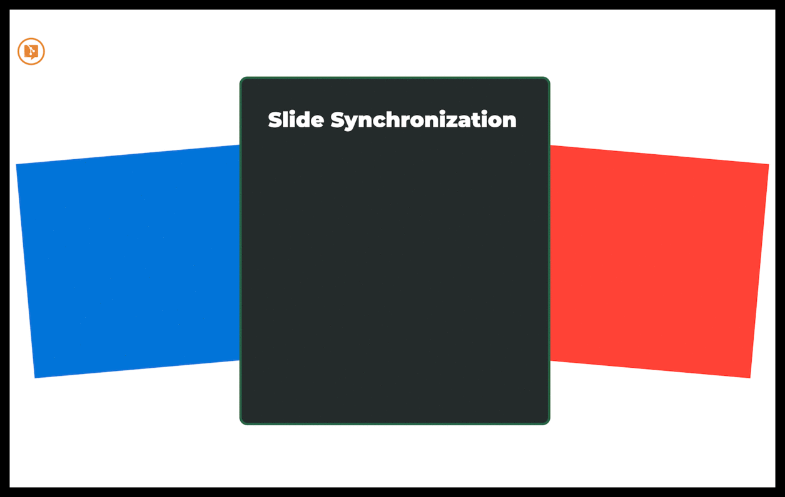

# Grid Synchronization

The grid *sync* property is used to synchronize behavior across fragment-aware elements on a slide. Fragment-aware elements include [lists](/lists/widget.md) and [stacks](/grid-layouts/stacks.md). When `sync=true` is activated it permits the simultaneous display of fragments across all participating slide elements.



?> Synchronized fragments can help you to focus an audience's attention on key concepts.

### Sync Activation

The following basic syntax is used to activate *sync* behavior on fragment-aware elements such as a list and a grid stack:

```
@ul[drag=width height, drop=x y, sync=true]
- First
- Second
@ul

[drag=width height, drop=x y, flow=stack, sync=true]

# Lorem
# Ipsum

```

By activating `sync=true` on two or more fragment-aware elements on your slide the display behavior of those elements is automatically linked. Here is a short video clip that demonstrates grid synchronization in action:


### Stack Ghosts

**How does synchronization behave when there are more items in the list than in the stack?**

This scenario is best understood by example. Let's start with a seemingly simple goal. We want to synchronize 3 list items with 2 just stack items with the following behavior:

1. The display of `List Item A` is synchronized with `Stack Item A`
1. The display of `List Item B` occurs on it's own.
1. The display of `List Item C` is synchronzied with `Stack Item C`

We try this using `sync=true` as shown in the following markdown snippet:

```markdown
@ul[list-spaced-lg-bullets, drag=50 100, drop=left, fit=2, sync=true]
- List Item A
- List Item B
- List Item C
@ul

[drag=50 100, drop=right, flow=stack, sync=true]
## Stack Item A
## Stack Stack C
```

If you try this markdown snippet in your own slide deck you will observe the following behavior:

1. The display of `List Item A` is synchronized with `Stack Item A`
2. The display of `List Item B` is synchronzied with `Stack Item C`
3. And the display of `List Item C` occurs own it's own.

This is not what we were hoping for in this case. So what happened?

Synchronization always matches content by *position* across fragment-aware elements. In this example the number of positions in our sample list does not match the number of positions in our sample stack. So we need to add an *empty element* aka. **@ghost** widget to our sample stack to positionally align our list and stack content as follows:

```markdown
@ul[list-spaced-lg-bullets, drag=50 100, drop=left, fit=2, sync=true]
- List Item A
- List Item B
- List Item C
@ul

[drag=50 100, drop=right, flow=stack, sync=true]
## Stack Item A
@ghost
## Stack Stack C
```

?> You can add as many **@ghost** elements to your stack as needed to align with your list content.

With the addition of the **@ghost** widget to our slide markdown if we now step through our sample slide we will see the desired behavior. You can copy the markdown snippet above and try this out in your own slide deck to familiarize yourself with these concepts.

