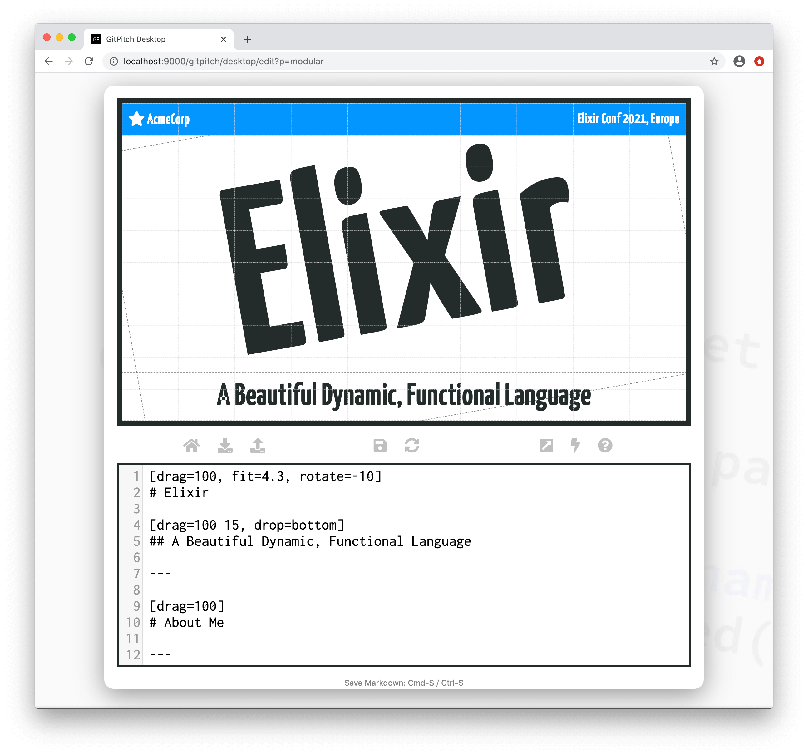
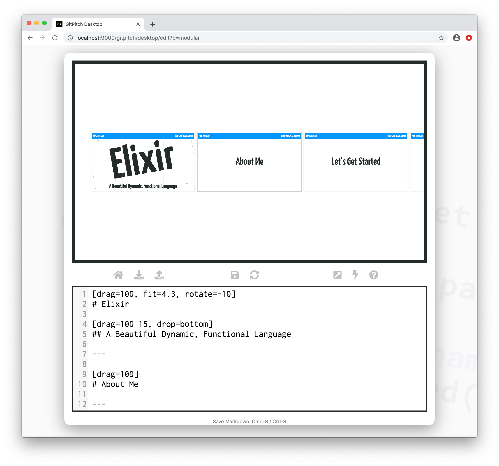
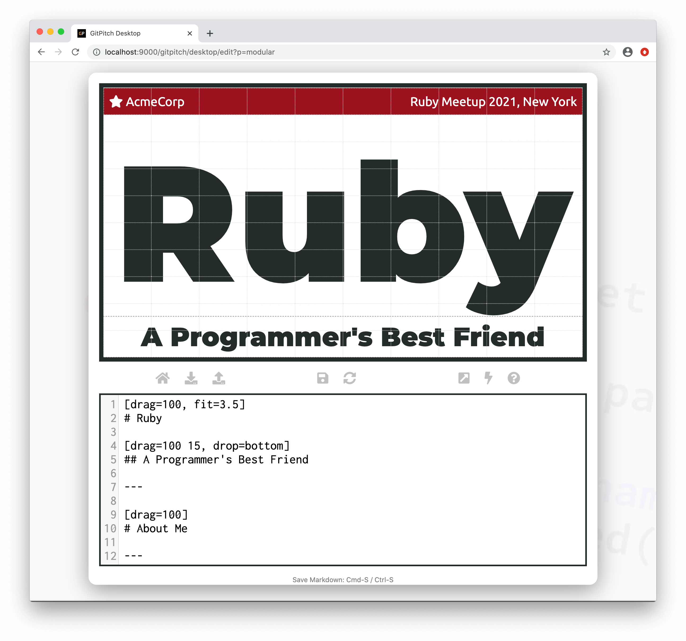

# Markdown Templates

A [markdown injection widget](/modular-markdown/injection.md) provide a simple way to inject a reusable markdown snippet on **any** slide. A markdown template provides a simple way to inject a reusable markdown snippet on **every** slide.

Templates are perfect for injecting custom branding or core messaging across all sides in your slide decks. For example, you could advertise your project using it's name and logo. You could promote your company website. Or add a note of appreciation to sponsors at a meetup or conference.

?> A GitPitch Markdown Template is similar in concept to a PowerPoint or Keynote Master Slide.

### Activation

To enable a markdown template you must activate the `template` setting in the [PITCHME.yaml](/conventions/pitchme-yaml.md) for your slide deck. For example:

```yaml
template: path/to/template.md
```

The value on this setting must be a relative path to a markdown file within your local working directory or Git repo. That file must contain valid [PITCHME.md](/conventions/pitchme-md.md) markdown content. That content should be positioned and sized using one or more [grid layout blocks](/grid-layouts/drag-and-drop.md).

### Sample Template


The following sample slide deck uses a template to promote a business `AcmeCorp` alongside a promotion for a conference event itself, `Elixir Conf 2021, Europe`. The markdown template is defined as follows in an `assets/md/template.md` file:

```markdown
[drag=100 10, drop=top, flow=row true, bg=#0396FF, pad=0 20px, set=text-white]

@fa[star] AcmeCorp
Code Camp 2021, Dublin
```

The template is activated for the slide deck in the [PITCHME.yaml](/conventions/pitchme-yaml.md) as follows:

```yaml
template: assets/md/template.md
```

Wit this template activated for our slide deck a sample slide looks as follows:



Viewing our sample side deck in *overview mode* we can see that the markdown template has been activated consistently across all slides in the deck:



### Template Globals

Template markdown can be defined using [variables](/modular-markdown/variables.md) and then take advantage of [markdown globals](/modular-markdown/globals.md) to inherit default appearance, content, and behavior.


For example the template defined above could be redefined using variables so the template background color and conference name are inherited directly from global settings values:

```markdown
[drag=100 10, drop=top, flow=row true, bg={{banner}}, pad=0 20px, set=text-white]

@fa[star] AcmeCorp
{{conference}}
```

Now without having to make any changes to the markdown for our slide deck we can easily *re-brand* our existing slide deck for a new conference or meetup:

```yaml
globals: [ "banner=#9b111e", "conference=Ruby Meetup 2021, New York" ]
```

Our markdown template inherits these *globals* settings and renders as follows:



The sample templates in this guide are provided to demonstrate the template mechanism. Your own template content can be as simple or sophisticated as you wish.
