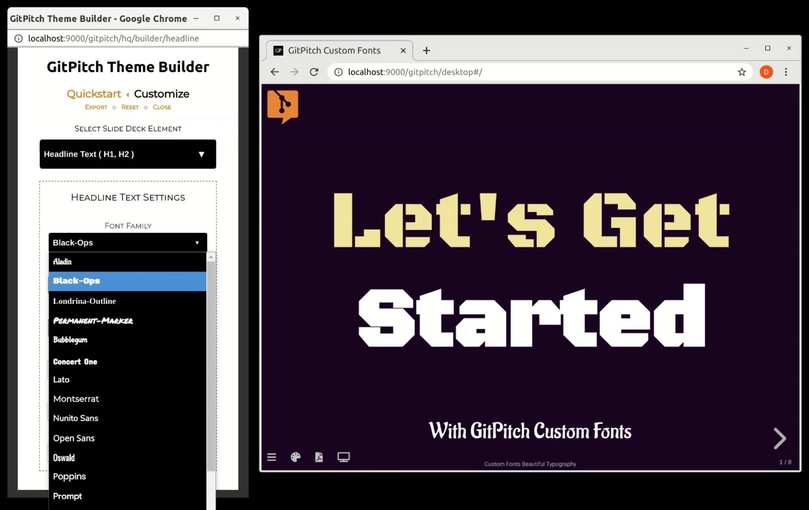

# Custom Fonts

Support for custom fonts lets you accurately reflect the brand of any project, conference, or business within GitPitch slide decks.

?> Licensed commercial fonts and free Web fonts can be used including [Google Web Fonts](https://fonts.google.com/).

<iframe id="youtube" width="900" height="600" src="https://www.youtube.com/embed/sTfiRHlK1yc" frameborder="0" allow="accelerometer; autoplay; encrypted-media; gyroscope; picture-in-picture" allowfullscreen></iframe>

Custom fonts are managed directly alongside other asset dependencies for your slide decks directly within your Git repository. This guide describes how you can activate custom fonts for your slide decks:

1. [Download Woff Woff2](#download-woff-woff2)
1. [Register Fonts](#register-fonts)
1. [Activate by Builder](#activate-by-builder)
1. [Activate Manually](#activate-manually)

### Download Woff Woff2

Download your custom font files and add them as asset depedencies for your slide deck. Both **woff** and **woff2** file formats are supported. For example, the following files and directory structure shows a sample slide deck with custom font dependencies:


```text
.
├── assets
│   ├── css
│   │   └── PITCHME.css
│   │
│   ├── fonts
│   │   ├── Aladin.woff2
│   │   ├── Black-Ops.woff2
│   │   ├── Londrina-Outline.woff
│   │   └── Permanent-Marker.woff2
│   │
│   └── img
│       └── logo.png
│
├── PITCHME.md
└── PITCHME.yaml
```

### Register Fonts

Register the `custom-fonts` property in your [PITCHME.yaml](/conventions/pitchme-yaml.md). This array property lets you register one or more custom fonts for your slide deck. The following snippet shows how to register a single custom font:

```yaml
custom-fonts : [ "assets/fonts/Aladin.woff2" ]
```

?> All paths to custom font files specified within [PITCHME.yaml](conventions/pitchme-yaml.md) must be relative to the *root directory* of your local working directory or Git repository.

The following snippet shows how to register multiple custom fonts:

```yaml
custom-fonts : [
  "assets/fonts/Aladin.woff2",
  "assets/fonts/Black-Ops.woff2",
  "assets/fonts/Londrina-Outline.woff",
  "assets/fonts/Permanent-Marker.woff2"
]
```

?> All paths to custom font files specified within [PITCHME.yaml](conventions/pitchme-yaml.md) must be relative to the *root directory* of your local working directory or Git repository.

### Activate by Builder

Once your custom fonts have been [registered within your PITCHME.yaml](#register-fonts) you can immediately activate those fonts for headline, byline, and plain text within your slide deck. The simplest way to do this is to use the [Theme Builder](/theme/builder.md) as shown here:



The Theme Builder is automatically aware of registered custom fonts and makes them available alongside the full set of built-in fonts for headline, byline, and plain-text content.


### Activate Manually

If for any reason you prefer not to use the [Theme Builder](/theme/builder.md) you can activate your custom fonts directly on the following Theme Template settings:

- [Theme Headline Setting](/theme/template.md?id=headline-setting) 
- [Theme Byline Setting](/theme/template.md?id=byline-setting) 
- [Theme Plain Text Setting](/theme/template.md?id=text-setting) 

The name of the *font family* for a custom font is derived directly from the [registered filename](#register-fonts) specified within your PITCHME.yaml file.

For example, if you registered `assets/fonts/Aladin.woff2` then you would reference this font using the `Aladin` font-family name. And if you registered `assets/fonts/Permanent-Marker.woff2` you would use `Permanet-Marker` as the font-family name.

!> Font-family names are case-sensitive and match exactly the case used when registered. Your custom font filenames must not contain spaces or other special characters.

